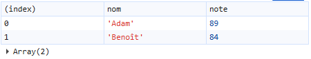

# Sorties en console avec Node.js

## 1. L'objet `console` et la méthode `console.log()`

En JavaScript, `console` est un **objet global** fourni par l'environnement d'exécution (navigateur web ou Node.js) qui **sert principalement à afficher des informations** de débogage, des messages et des données pendant l'exécution d'un programme.

👉 Ce n'est pas un objet défini par le langage JavaScript lui-même, mais par l'environnement hôte.

`console.log()` est la méthode standard pour afficher du texte dans la console. Elle ajoute automatiquement un retour à la ligne.

### Utilités de `console`

- Observer l'état d'un programme
- Afficher des valeurs de variables
- Diagnostiquer des erreurs
- Mesurer des performances
- Tester rapidement du code

### Méthodes principales de `console`

|Méthode|Description sommaire|Exemple(s)|Affichage produit|
|---|---|---|---|
|`console.log()`|Affiche un message standard|`console.log('Bonjour!');`|`Bonjour!`|
|||`console.log('Bonjour!', 42, true);`|`Bonjour! 42 true`|
|`console.error()`|Affiche un message d'erreur (souvent en rouge)|`console.error("Une erreur est survenue");`|`Une erreur est survenue`|
|`console.warn()`|Affiche un avertissement (jaune)|`console.warn("Attention : valeur inhabituelle");`|`Attention : valeur inhabituelle`|
|`console.info()`|Message informatif (équivalent visuel à log dans plusieurs environnements)|`console.info("Information utile");`|`Information utile`|
|`console.table()`|Affiche un tableau ou un tableau d'objets sous forme de lignes + colonnes|`console.table([{nom: "Adam", note: 89}, {nom: "Benoît", note: 84}]);`||
|`console.clear()`|Efface la console|`console.clear();`|(Aucun)|

### Où s'affiche la console?

|Navigateur|Node.js|
|---|---|
|Outils de développement → onglet **Console**. [Raccourci : `F12` ou `Ctrl + Shift + I`]|La sortie s'affiche directement dans le **terminal**|

## 2. L'objet `process.stdout` et la méthode `process.stdout.write()`

En Node.js, `process` est un **objet global** qui représente le **processus Node en cours d'exécution**.

👉 `process.stdout` est un **flux de sortie** (*stream*) correspondant à la **sortie standard** (*standard output*), généralement le **terminal**.

> Autrement dit :  
> `process.stdout` = là où Node écrit le texte destiné à être affiché à l'écran

### Équivalence avec `console`

```javascript
console.log("Bonjour");
// est équivalent conceptuellement à :
process.stdout.write("Bonjour\n");
```

📌 `console.log()` est une **abstraction plus simple**, basée sur `process.stdout`.

### Méthode principale de `process.stdout`

|Méthode|Description sommaire|Exemple(s)|Affichage produit|
|---|---|---|---|
|`process.stdout.write()`|Affiche un message standard|`process.stdout.write('Bonjour!');`|`Bonjour!` (sans retour de ligne)|

### Quand utiliser process.stdout ?

- Programmes en ligne de commande (CLI)
- Jeux texte / menus console
- Affichage progressif (barre de progression)
- Redirection vers un fichier (node app.js > sortie.txt)
- Contrôle précis de l'affichage
❌ Pas utile en JavaScript côté navigateur

## 3. Comparaison `console.log()` versus `process.stdout.write()`

|Critère|`console.log()`|`process.stdout.write()`|
|---|---|---|
|Ajoute `\n`|Oui|Non|
|Conversion automatique|Oui (tableaux, objets → string)|Non|
|Asynchrone|Oui|Oui|
|Utilité|Débogage|Sortie contrôlée/formatée|
|Lisibilité|Simple|Plus bas niveau|

## Exemples particuliers de sorties

```javascript
process.stdout.write("Progression : ");
for (let i = 0; i < 10; i++) {
    await new Promise(r => setTimeout(r, 200)); // pour attendre 200 milisecondes
    process.stdout.write("#");
}
process.stdout.write(" Terminé !\n");
```
