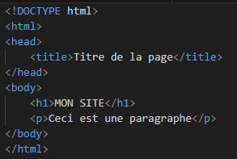
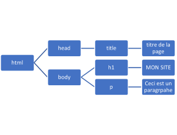

# Introduction au DOM

## Table des matières

- [1. Présentation](#1-présentation)
- [2. Avantages à utiliser le DOM](#2-avantages-à-utiliser-le-dom)
  - [Actions possibles avec le DOM](#actions-possibles-avec-le-dom)
- [3. Sélectionner des éléments du DOM](#3-sélectionner-des-éléments-du-dom)
  - [L'objet natif `document`](#lobjet-natif-document)
  - [Méthodes de `document` permettant de sélectionner des éléments du DOM](#méthodes-de-document-permettant-de-sélectionner-des-éléments-du-dom)
    - [`getElementById(id)`](#getelementbyidid)
    - [`getElementsByClassName(names)`](#getelementsbyclassnamenames)
    - [`getElementsByTagName(name)`](#getelementsbytagnamename)
    - [`querySelector(selectors)`](#queryselectorselectors)
    - [`querySelectorAll(selectors)`](#queryselectorallselectors)

---

## 1. Présentation

### DOM = Document Object Model

L'[API DOM](https://developer.mozilla.org/fr/docs/Web/API/HTML_DOM_API) est un ensemble d'objets et de méthodes qui permet à JavaScript de lire, parcourir et modifier une page HTML pendant qu'elle est affichée dans le navigateur.

Les éléments de la page web sont organisés sous forme d'une arborescence. On aura donc des noeuds, pouvant eux même contenir ou non d'autres noeuds. Le noeud de base, ou noeud racine (*root node*) est la balise `<html>`.

|Élément|Description|
|---|---|
|`HTML`|Contenu écrit/généré par le développeur|
|`DOM`|Version interprétée et structurée par le navigateur|

Le navigateur transforme le HTML en objets JavaScript.

 

## 2. Avantages à utiliser le DOM

Le DOM permet d'avoir accès aux différents éléments du document HTML. Ainsi, on pourra avoir du contenu qui change sans avoir à recharger la page, permettant une expérience de navigation plus fluide pour l'utilisateur.

### Actions possibles avec le DOM

- Modifier un style
- Faire apparaître / disparaître un élément
- Insérer des balises
- Supprimer un élément
- Réagir à des évènements (clic, ouverture de page, etc.)
- Etc.

## 3. Sélectionner des éléments du DOM

Dans l'API DOM, [l'interface `Window`](https://developer.mozilla.org/fr/docs/Web/API/Window) représente la fenêtre (ou l'onglet) du navigateur dans laquelle une page web est affichée. C'est **l'objet global principal** côté navigateur : presque tout passe par lui.

### L'objet natif `document`

La propriété `window.document`, ou tout simplement `document`, renvoie une référence au document contenu dans la fenêtre. C'est une instance de [l'interface `Document`](https://developer.mozilla.org/fr/docs/Web/API/Document) qui possède plusieurs propriétés et méthodes intéressantes dont voici les plus utiles.

### Méthodes de `document` permettant de sélectionner des éléments du DOM

Les méthodes suivantes permettent de sélectionner des éléments du DOM à partir de différents critères (id, classe, balise, sélecteurs CSS, etc.). Elles retournent un ou plusieurs éléments du DOM sous forme d'une `HTMLCollection` ou d'une `NodeList`, ou `null` si aucun élément n'est trouvé.

#### `getElementById(id)`

Méthode qui retourne un élément correspondant à l'`id` fourni.

```html
<body>
  <h1>MON SITE</h1>
  <p id="intro">Paragraphe d'introduction</p>
  <script>
    let paragraphe = document.getElementById('intro');
    console.log(paragraphe);
  </script>
</body>
```

#### `getElementsByClassName(names)`

Méthode qui retourne une `HTMLCollection` contenant tous les éléments ayant la (ou les) classe(s) `names`.

```html
<body>
  <h1>MON SITE</h1>
  <p id="intro" class="par">Paragraphe d'introduction</p>
  <p class="par">Paragraphe de développement</p>
  <p class="par">Paragraphe de conclusion</p>
  <script>
    let classPar = document.getElementsByClassName('par');
    console.log(classPar[0]);
  </script>
</body>
```

#### `getElementsByTagName(name)`

Méthode qui retourne tous les éléments d'une balise `name` donnée sous forme d'une `HTMLCollection`.

```html
<!DOCTYPE html>
<html>
  <body>
    <h1>MON SITE</h1>
    <p id="intro" class="par">Paragraphe d'introduction</p>
    <p class="par">Paragraphe de développement</p>
    <p class="par">Paragraphe de conclusion</p>
    <script>
      let tagP = document.getElementsByTagName('p');
      console.log(tagP);
    </script>
  </body>
</html>
```

#### `querySelector(selectors)`

Méthode qui retourne **le premier** élément correspondant au sélecteur `selectors` fourni (CSS : `#id`, `.classe`, `balise`, sélecteurs hiérarchiques, etc.).

```html
<body>
  <h1>MON SITE</h1>

  <div id="intro">
    <h2>Titre intro</h2>
    <p class="par">Paragraphe d'introduction 1</p>
    <p class="par">Paragraphe d'introduction 2</p>
  </div>

  <div id="dev">
    <h2>Titre développement</h2>
    <p class="un">Paragraphe de développement 1</p>
    <p class="deux">Paragraphe de développement 2</p>
  </div>

  <script>
    let select1 = document.querySelector('div');
    console.log(select1);

    let select2 = document.querySelector('#intro p');
    console.log(select2);

    let select3 = document.querySelector('#dev p.deux');
    console.log(select3);
  </script>
</body>
```

#### `querySelectorAll(selectors)`

Comme `querySelector(selectors)`, mais retourne **tous** les éléments correspondants (`NodeList` statique avec les éléments si trouvés, ou `NodeList` vide sinon).

#### Les sélecteurs du DOM en résumé

|Méthode|Description|Valeur de retour|
|---|---|---|
|[`document.getElementById(id)`](https://developer.mozilla.org/fr/docs/Web/API/Document/getElementById)|Retourne un élément correspondant à l'`id` fourni|Un élément du DOM ou `null`|
|[`document.getElementsByClassName(names)`](https://developer.mozilla.org/fr/docs/Web/API/Document/getElementsByClassName)|Retourne tous les éléments ayant la (ou les) classe(s) `names`|Une `HTMLCollection` (collection dynamique d'éléments du DOM)|
|[`document.getElementsByTagName(name)`](https://developer.mozilla.org/fr/docs/Web/API/Document/getElementsByTagName)|Retourne tous les éléments d'une balise `name` donnée|Une `HTMLCollection` (collection dynamique d'éléments du DOM)|
|[`document.querySelector(selectors)`](https://developer.mozilla.org/fr/docs/Web/API/Document/querySelector)|Retourne le premier élément correspondant au sélecteur `selectors` fourni|Un élément du DOM ou `null`|
|[`document.querySelectorAll(selectors)`](https://developer.mozilla.org/fr/docs/Web/API/Document/querySelectorAll)|Retourne tous les éléments correspondant au sélecteur `selectors` fourni|Une `NodeList` (collection statique d'éléments du DOM)|
